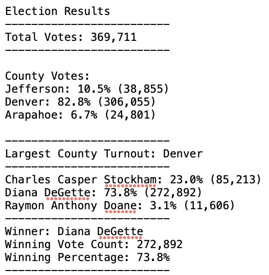

# election_analysis_challenge

# Project Overview
* Evaluates election data and voter turnout per county using Python.

1. The voter turnout for each county.
2. The percentage of votes from each county out of the total count.
3. The county with the highest turnout.

## Resources:

* Data Source: election_results_challenge.csv
* Software: Python 3.9.7, Visual Studio Code

# Election-Audit Results:

- A total of 369,711 votes were cast in the congressional elections as follows:

    * County Votes:

        - Jefferson: 10.5% (38,855)

        - Denver: 82.8% (306,055)

        - Arapahoe: 6.7% (24,801)

- Denver had the largest number of votes.

    * Candidate Votes:

        - Charles Casper Stockham: 23.0% (85,213)

        - Diana DeGette: 73.8% (272,892)

        - Raymon Anthony Doane: 3.1% (11,606)

- Diana DeGette won the election with 272,892 votes or 73.8% of the total votes. 

# Election-Audit Summary:

* The attached Python script may be used for future elections by:
 
 1. Changing the data source (see line 12 - election_results_challenge.csv) or line 9 of the python code for the respective election year's .csv file needing analysis to determine a winner.

 2. Determination of the losing candidates with the lowest number of votes may occur by changing the if statement votes > winning count to if votes < winning_count and vote_percentage < winning_percentage. Note: Must ensure to change print output variable to "losing_candidate_summary" or other appropriate variable name.

